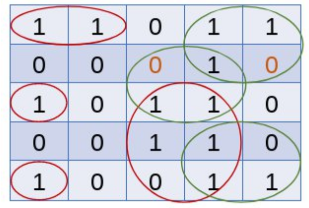
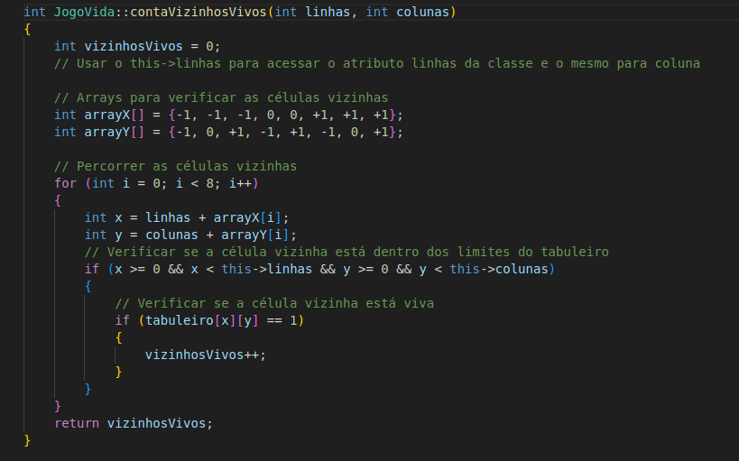

<h1 align="center"><b>Trabalho JOGO DA VIDA</b></h1>

<!-- imagem -->

## 📌 Sumário
- [Introdução](#Introdução)
- [Objetivos](#Objetivos)
- [Problema apresentado](#Problema-apresentado)
- [Arquivos](#Arquivos)
- [Resolução do Problema](#Resolução-do-problema)
- [Resultados](#Resultados)
- [Conclusão](#Conclusão)
- [Compilação e execução](#Compilação-e-execução)
- [Contato](#Contato)

## ✒️ Introdução

    O jogo da Vida é um autômato celular desenvolvido pelo matemático John Conway na década de 1970.  
    O jogo da Vida acontece em uma grade bidimensional, onde cada célula pode estar viva ou morta. O jogo evolui em etapas de tempo, seguindo algumas regras básicas que determinam o estado de cada célula nas gerações subsequentes. 

## 💻 Objetivos
O principal objetivo desse trabalho é revisar conceitos anteriores já vistos no curso, principalmente a questão de manipulação de matrizes, que é usada para o controle de fluxo e lógica do jogo.

## Problema apresentado
<strong><h4>Regras Principais:</h4></strong>
- Crie uma matriz N x N para representar o tabuleiro do Jogo da Vida.
- Inicialize o tabuleiro com células vivas (1) e mortas (0).
- Implemente uma função para exibir o estado atual do tabuleiro.
- Implemente uma função para calcular a próxima geração do Jogo da Vida com base nas seguintes regras:
    - Uma célula viva com menos de dois vizinhos vivos morre (solidão).
    - Uma célula viva com mais de três vizinhos vivos morre (superpopulação).
    - Uma célula viva com dois ou três vizinhos sobrevive.
    - Uma célula morta com exatamente três vizinhos vivos se torna viva (reprodução).

 

<strong><h4>Condições impostas:</h4></strong>
- Ler a matriz de entrada em um arquivo, considerando um tamanho mínimo de 5x5.
- Considere uma fração de 2 para 1 para compor os valores de 0s e 1s, sendo o número de 1s em menor quantidade para produzir um melhor espalhamento.
- A cada interação, faça as avaliações utilizando a matriz atual e produza os resultados da avaliação em uma nova matriz. Feito isso, salve a matriz avaliada como parte de seus resultados em um arquivo chamado gerações.mps.
- O arquivo gerações.mps deve ser organizado para mostrar todas as evoluções, contando inclusive com a matriz de origem da execução.
- Na tela, basta apresentar as mensagens de algoritmo executando e processo de geração finalizado.
- Como entradas, pedir ao usuário para digitar apenas o número de gerações a ser avaliado.
- Para a matriz de entrada, crie uma pasta chamada datasets dentro do seu projeto e fora da pasta src, armazenando-a como input.mps.

## 📄 Arquivos
- **Main.cpp:** Primeiro recebe como entrada a quantidade de gerações que o usuário deseja. Depois é chamada as funções para inicializar o tabuleiro e escrever no arquivo, após isso, são chamadas as próximas gerações com a função proximoCiclo, e isso dentro de um for para que seja feita a quantidade escolhida anteriormente.
- **JogoVida.hpp:** Criadas as funções que irão fazer todo o fluxo e lógica do jogo, e também escreve no arquivo.
- **JogoVida.cpp:** Feita a estruturação das funções criadas no arquivo JogoVida.hpp.

## 🔨 Resolução do problema
<h3><b>Implementação do Jogo</b></h3>

*Arquivos JogoVida.hpp e JogoVida.cpp* 
- `inicializarMundo`: Lê a matriz do arquivo input.mps.
- `imprimeMundo`: imprime o tabuleiro.
- `escreverArquivo`: escreve o tabuleiro atual no arquivo gerações.mps
- `contaVizinhosVivos`: Recebe como parâmetro uma casa do tabuleiro e verifica quantos vizinhos vivos ela tem, por meio de um sistema de joystick.
- `proximoCiclo`: Percorre o tabuleiro verificando quantos vizinhos vivos cada posição tem (usando a função acima), e a partir disso, verifica se de acordo com as regras impostas, ela continuará viva ou morta para a próxima geração. E por fim, ela atualiza o tabuleiro.
- `verificaIgualdade`: Esse atributo é usado para verificar se duas gerações seguidas são iguais, determinando que o jogo chegou ao fim, pois o tabuleiro continuará sempre igual.

  
  

## 🎯 Resultados
Como resultado, temos todas as gerações criadas salvas no arquivo gerações.mps (a quantidade escolhida pelo usuário). Lembrando também que caso tenham duas gerações seguidas iguais, o jogo deve ser encerrado e mostrada uma mensagem na tela. Nesse caso, o jogo terminaria antes do previsto.

## ✔️ Conclusão
Ao final desse projeto, temos que o objetivo foi alcançado, uma vez que foram usados vários conceitos vistos anteriormente no curso, como manipulação de matrizes e de arquivos. Sobre o jogo em si, foi notável que é um jogo muito interessante e, apesar de suas regras simples, é capaz de gerar padrões surpreendentemente complexos e até mesmo simular fenômenos semelhantes aos observados na vida real, como a formação de estruturas estáveis, osciladores e espaçonaves.

## 👾 Compilação e execução
* Especificações da máquina em que o código foi rodado:
  * Processador AMD Ryzen7 5700u;
  * Sistema Operacional Ubuntu 22.04;
  * 12GB de RAM.
* | Comando         | Função                                                                             |                     
  | ----------------| -----------------------------------------------------------------------------------|
  | `make clean`    | Apaga a última compilação realizada contida na pasta build                           |
  | `make`          | Executa a compilação do programa utilizando o gcc, e o resultado vai para a pasta build |
  | `make run`      | Executa o programa da pasta build após a realização da compilação                     |
